# 🎵 PlanMyConcert

Website statis untuk pemesanan tiket konser online di Indonesia.  
Dibuat untuk project UAS mata kuliah **Pemrograman Web 1** dengan penerapan HTML, CSS, JavaScript, dan Bootstrap.

---

## 👥 Anggota Kelompok
- Lulu Amanda (0110125017)
- Rafa Azizah (0110125022)
- Faturrahman Syamil (0110125080)
- Muhamad Rizky Julian (0110125079)
- Bilqis Ainiyyah Fatin Dotulong (0110125115)

---

## 📖 Deskripsi Website
PlanMyConcert adalah platform simulasi pemesanan tiket konser musik.  
Website ini menyediakan informasi konser, blog/artikel, galeri, FAQ, serta form pemesanan tiket dengan fitur interaktif.  
Tujuan website adalah memberikan pengalaman pengguna yang modern, responsif, dan mudah digunakan.

---

## 🌐 Struktur Halaman
Website terdiri dari minimal 10 halaman:
1. `index.html` – Beranda  
2. `concerts.html` – Daftar konser tersedia  
3. `booking.html` – Form pemesanan tiket  
4. `confirmation.html` – Halaman konfirmasi pemesanan  
5. `gallery.html` – Galeri foto konser  
6. `blog.html` – Artikel & tips konser  
7. `faq.html` – Pertanyaan umum  
8. `about.html` – Tentang PlanMyConcert  
9. `contact.html` – Form kontak  
10. `terms.html` – Ketentuan penggunaan  

---

## 🎨 Fitur Styling

- **CSS Custom**:
  - Dark mode styling (`.dark` class)
  - Custom button (`.btn-ct`)
  - Custom card (`.card-ct`)
  - Hero section dengan background gradient
  - Navbar shadow saat scroll  

- **Bootstrap Components**:
  - Navbar responsive
  - Grid system (row, col)
  - Cards
  - Modal (gallery image modal)
  - Form control & validation  

Website sudah **responsif** untuk tampilan desktop dan mobile.

---

## ⚡ Fitur Interaktif (JavaScript)
1. **Dark Mode Toggle** dengan localStorage (persistensi tema)  
2. **Navbar shadow** saat scroll  
3. **Form validation** (email & nomor telepon)  
4. **Booking system** dengan perhitungan total harga tiket  
5. **Confirmation page** dengan kode booking unik  
6. **Gallery modal popup** untuk menampilkan gambar besar  
7. **Hero slider otomatis**  

---

## 🖼️ Media

- Setiap halaman memuat minimal 1 gambar (poster konser, galeri, dll).  
- Link internal antar halaman (misalnya dari `concerts.html` ke `booking.html`).  
- Link eksternal ke Instagram, YouTube, Twitter resmi STTNF.  
- Elemen multimedia: gambar slider & modal gallery.  

---

## 📂 Struktur Folder

```
/PlanMyConcert
│── index.html
│── about.html
│── contact.html
│── concerts.html
│── booking.html
│── confirmation.html
│── blog.html
│── faq.html
│── gallery.html
│── terms.html
│── /css
│    └── style.css
│── /js
│    └── script.js
│── /image
│    └── (about.jpg, aespa - Jakarta.jpg, aespa - SYNK.jpg, ATEEZ - ATEEZ 2026 World Tour.jpg, ATEEZ - Jakarta.jpg, bg pmc.jpg, BLACK PINK - Jakarta.jpg, blog.jpg, contact.jpg, Deep Purple & Slank - All Greatest Hits Live.jpg, demodark-beranda.png, demodark-blog.png, demodark-FAQ.png, demodark-galeri.png, demodark-ketentuan.png, demodark-konfirmasi.png, demodark-konser.png, demodark-kontak.png, demodark-pemesanan.png, demodark-tentang.png, demolight-beranda.png, demolight-blog.png, demolight-FAQ.png, demolight-galeri.png, demolight-ketentuan.png, demolight-konfirmasi.png, demolight-konser.png, demolight-kontak.png, demolight-pemesanan.png, demolight-tentang.png, Dream Theater - Jakarta.jpg, Dream Theater.jpg, EXO - Jakarta.jpg, faq.jpg, Hammersonic Festival 2026.jpg, hero 1.jpg, hero 2.jpg, hero 3.jpg, Konser - Jakarta.jpg, NCT - Jakarta.jpg, NCT WISH - INTO THE WISH.jpg, pemesanan.jpg, RIIZE - Jakarta.jpg, RIIZE - RIIZING LOUD.jpg, terms.jpg, TREASURE - Jakarta.jpg, TREASURE - PULSE ON IN Jakarta.jpg, Westlife - A Gala Evening.jpg)
```

---

## 🛠️ Teknologi yang Digunakan
- **HTML5** (struktur semantik)  
- **CSS3** (custom styling)  
- **Bootstrap 5.3.2** (framework styling & komponen)  
- **JavaScript murni** (interaktivitas)  

---

## 📸 Screenshot Tampilan
### Beranda

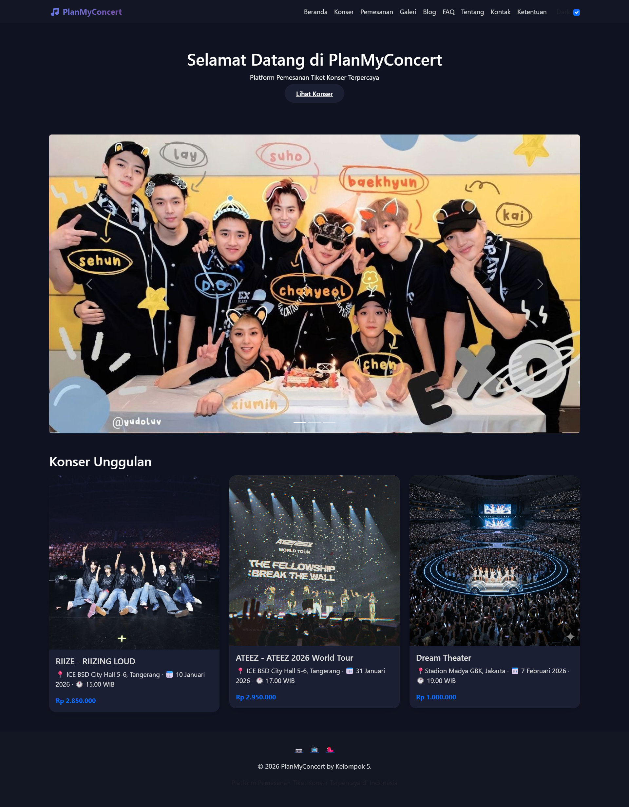

### Halaman Konser


### Form Pemesanan
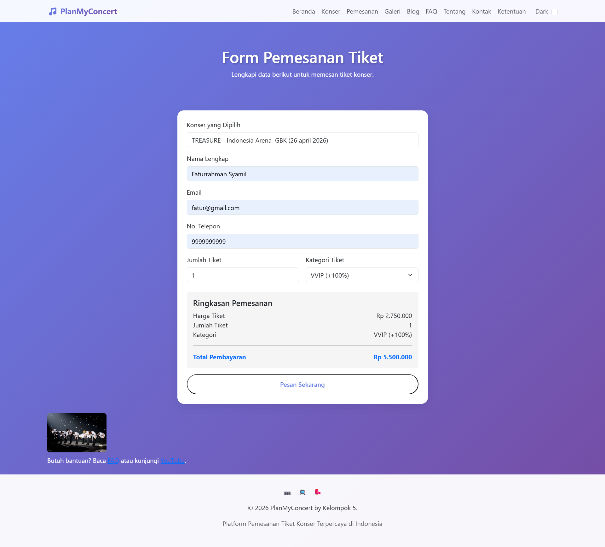
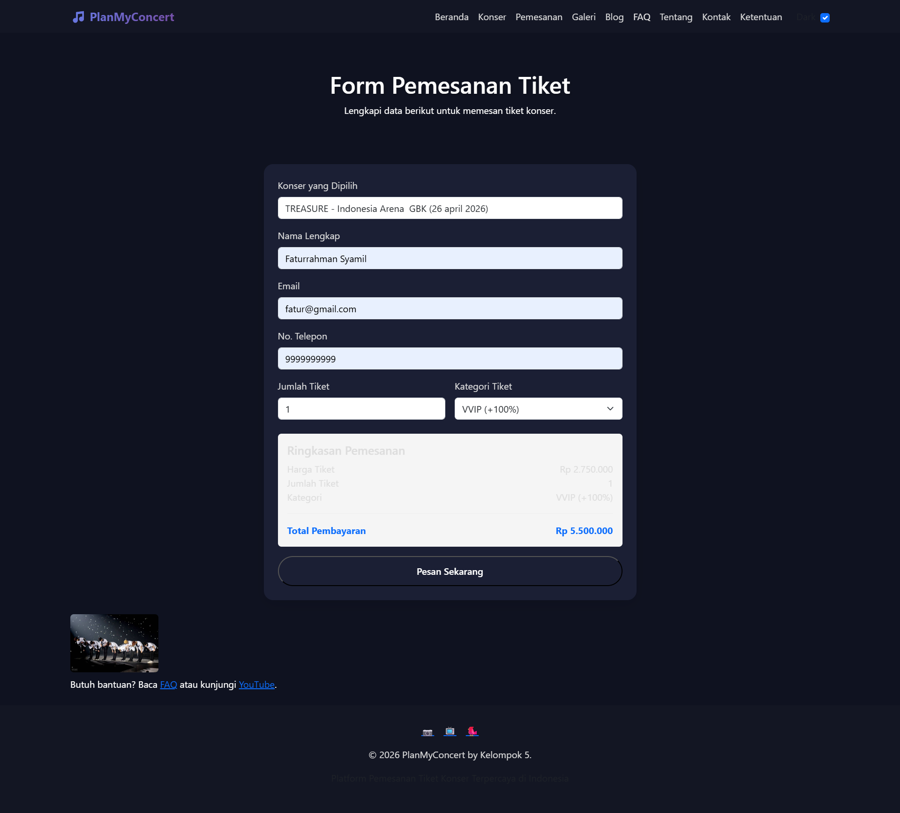

### Halaman Konfirmasi
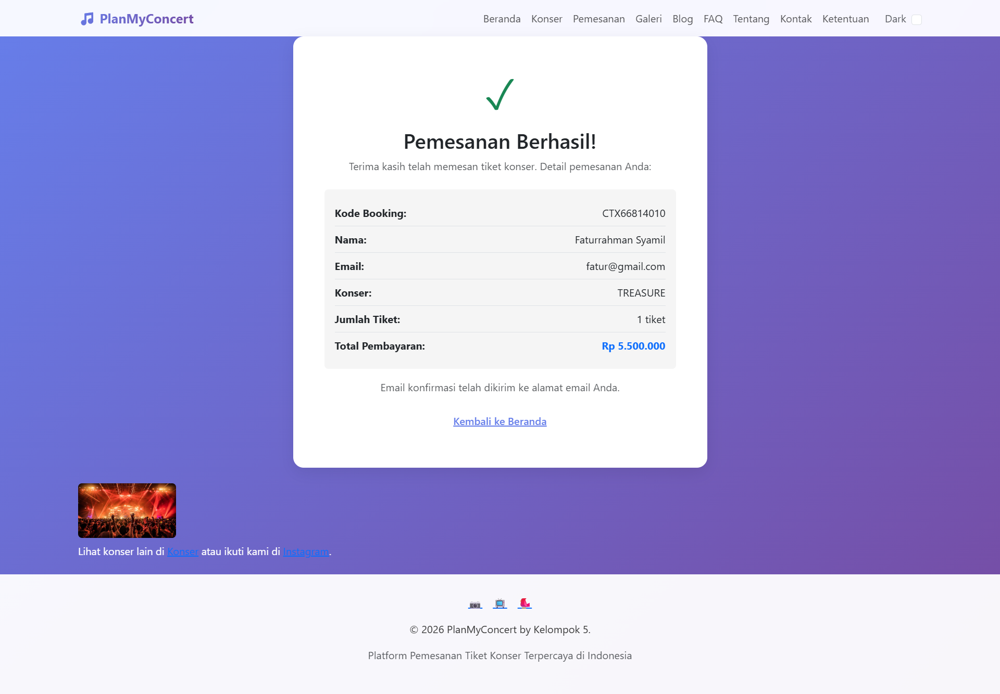
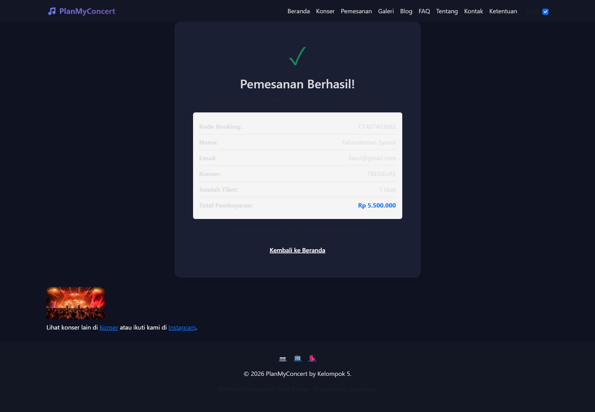

### Blog & Artikel
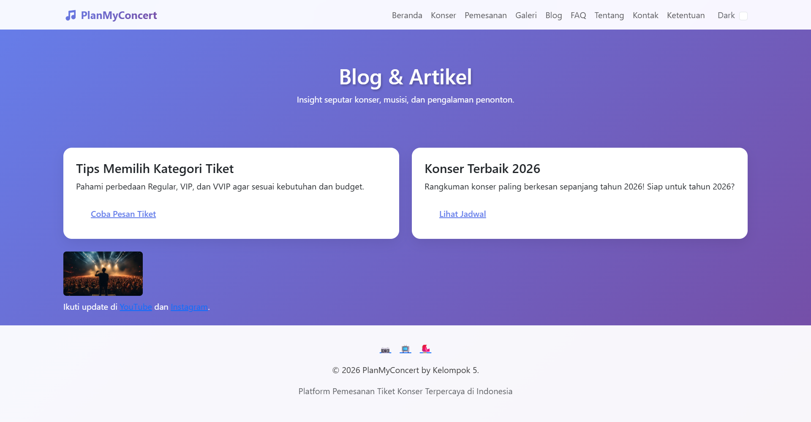
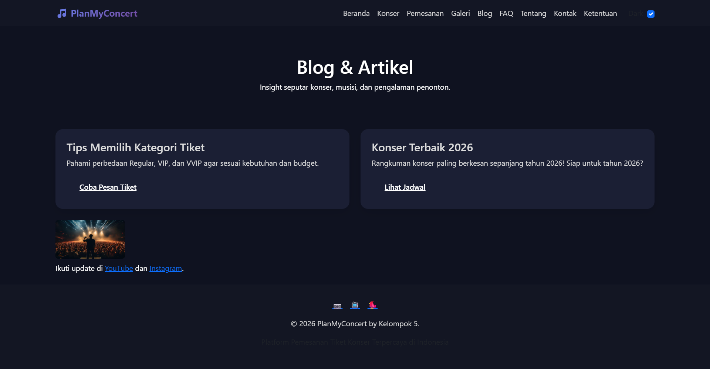

### FAQ
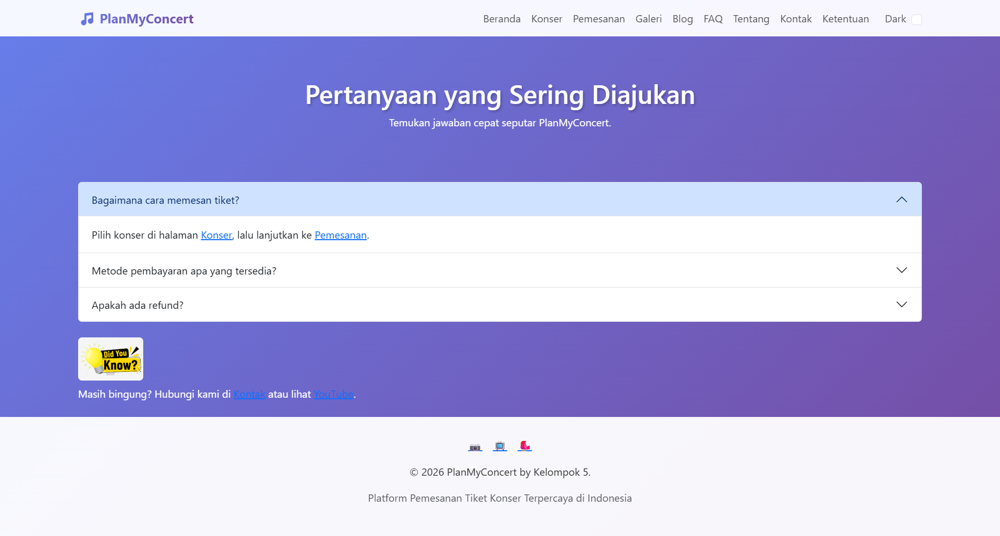
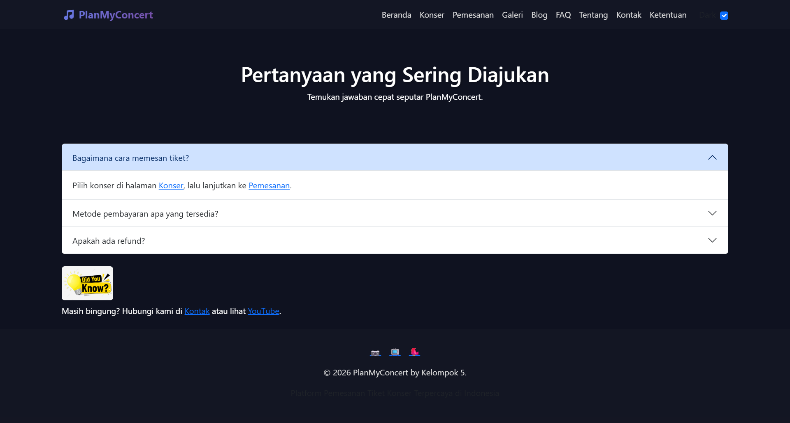

### Tentang
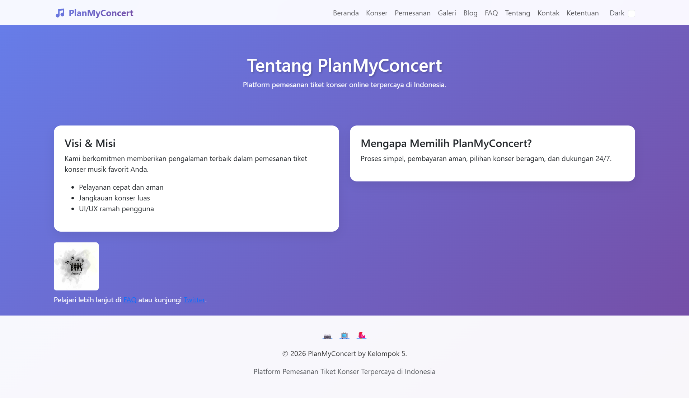
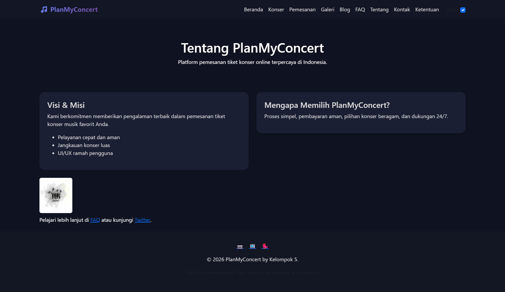

### Kontak
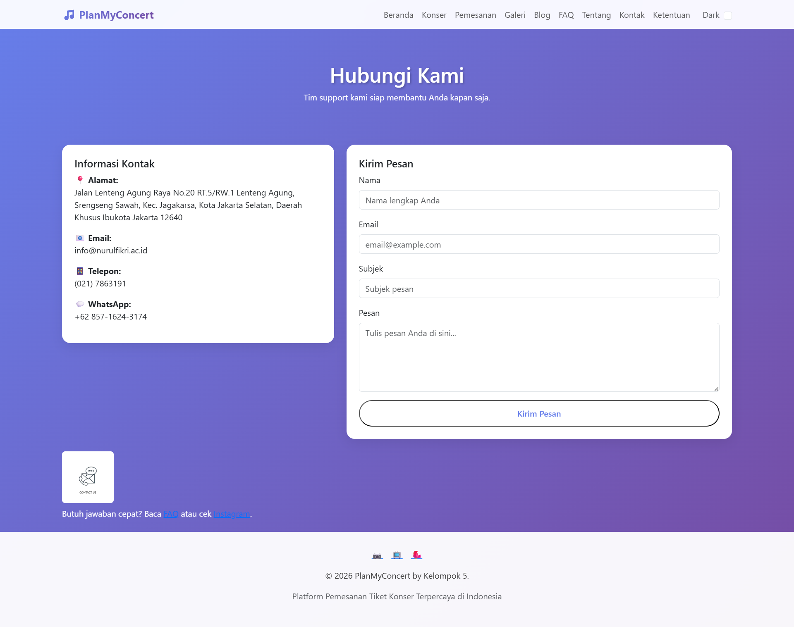
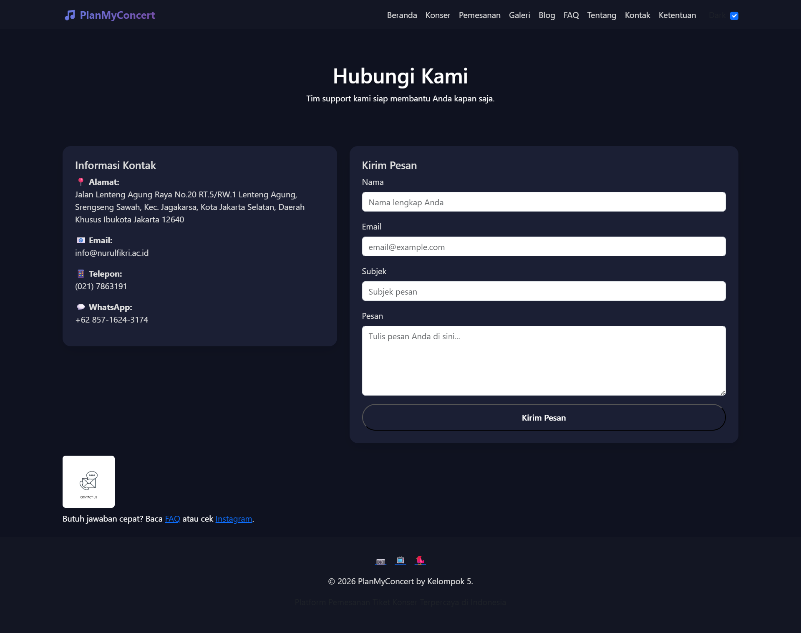

### Ketentuan
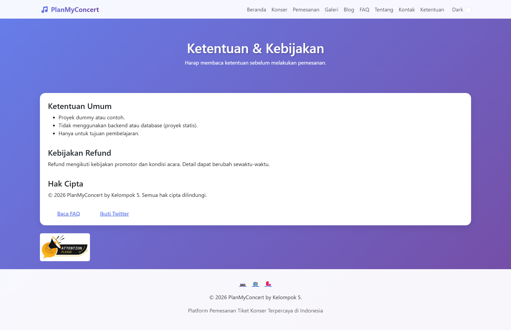
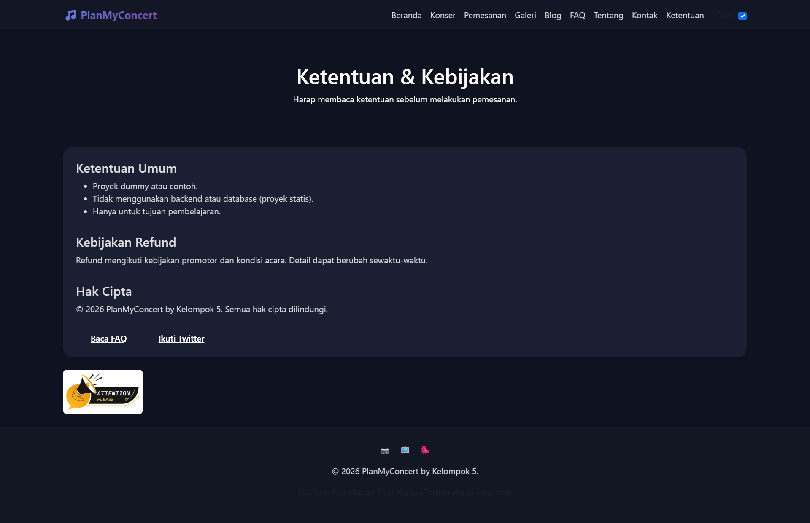

---
